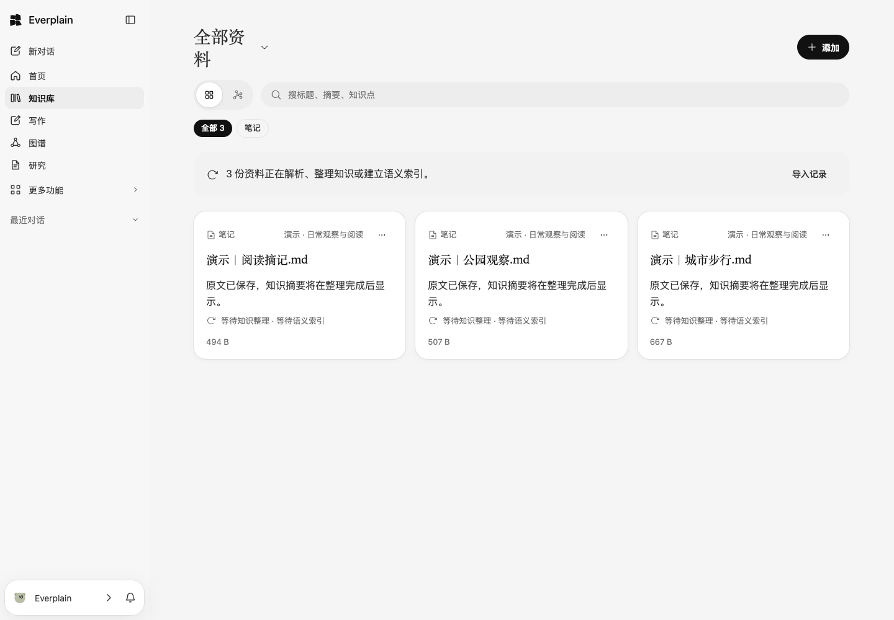
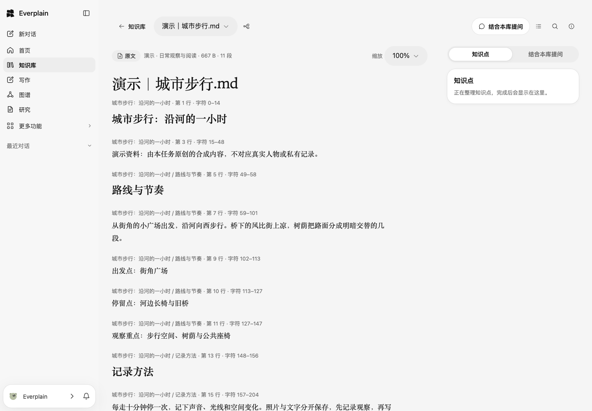
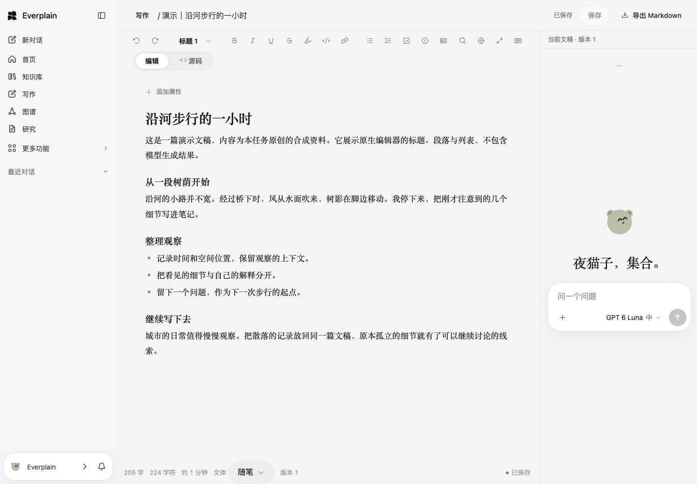
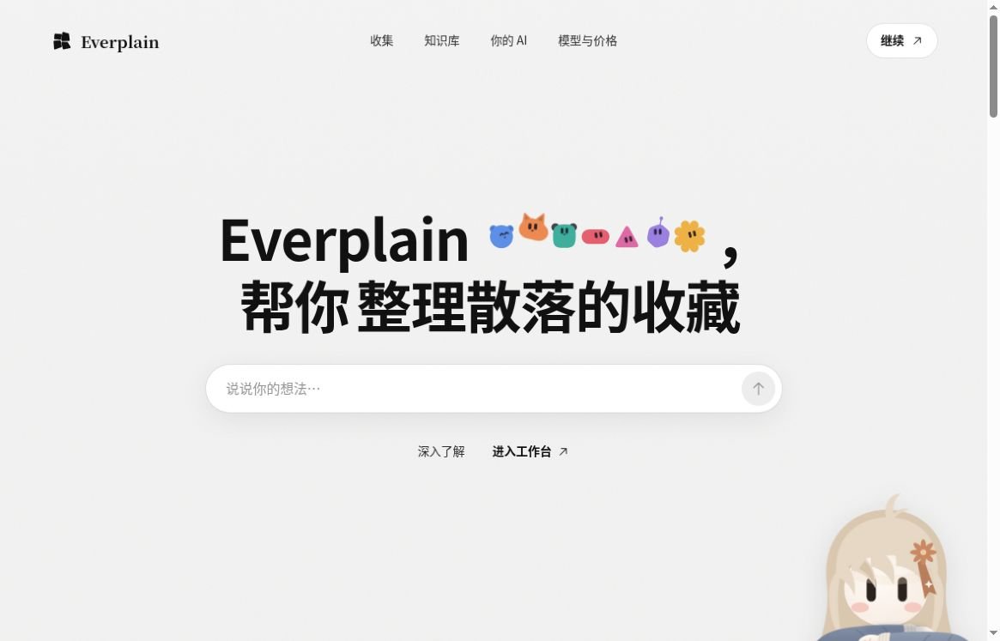

<div align="center">
  
  <h1>Everplain</h1>
  <p><strong>让散落的资料，成为可以继续思考的知识。</strong></p>
  <p>个人知识库 · 有出处的 AI 对话 · 研究与写作工作台</p>
  <p><strong>简体中文</strong> · <a href="README.en.md">English</a></p>
  <p>
    <a href="https://e.qunxue.xyz"><strong>在线使用：https://e.qunxue.xyz</strong></a>
    · <a href="https://github.com/huyanxius/everplain/issues">问题与建议</a>
    · <a href="docs/README.md">文档</a>
  </p>
  <p>
    <a href="https://github.com/huyanxius/everplain/actions/workflows/ci.yml"></a>
    <a href="backend/pyproject.toml"></a>
    <a href="frontend/package.json"></a>
    <a href="docs/DISTRIBUTION.md"></a>
  </p>
  
</div>

Everplain 把收藏、阅读、检索、研究和写作放在一个工作区。你可以从一份 PDF、一组书签或自己的笔记开始，围绕资料提问，打开引用核对原文，再把想法写成可修改、可导出的文稿。

资料默认属于自己的账号。AI 的名字、形象、表达方式和记忆可以调整，用户形象也可以独立选择。它适合长期积累与反复思考，不限定专业、学科或研究主题。

[功能](#可以做什么) · [导入方式](#把资料带进来) · [界面](#看看界面) · [快速开始](#本地快速开始) · [部署](#自行部署) · [参与开发](#参与开发)

## 可以做什么

| 工作环节 | 当前代码中的能力 |
| --- | --- |
| **收集与阅读** | 私有资料库；PDF、DOCX、PPTX、Markdown、TXT 上传；浏览器收藏、笔记导出包与图片导入；逐条处理状态、失败原因和重试；阅读原文 |
| **整理与连接** | 知识条目与关系；个人知识图谱；按资料、主题与知识点探索；从节点和引用返回对应来源；查看尚未完成整理的资料 |
| **围绕资料提问** | 选择自己的知识库，多轮对话；按部署能力使用检索、网络研究及工具；保留会话、执行过程和可点击引用 |
| **持续研究** | 从问题开始建立研究项目，组织资料、计划、研究画布及章节文稿；保留可以再次打开的工作状态 |
| **写作与修订** | 公文、报告、正式文体、小说、随笔；样文与风格参考；富文本/Markdown 编辑；AI 建议流式预览、差异审阅，确认后应用；保存版本与导出 |
| **自己的 AI** | 七种 AI 伙伴预设、名字与颜色；自由编辑表达偏好（Soul）；查看、调整和删除记忆；六种独立用户形象及发色、肤色、衣服颜色定制 |
| **账号与运维** | 邮箱验证码注册、密码登录；按配置启用 Google/GitHub 登录与绑定；账号数据导出/删除；管理员用户、用量和配额管理；备份与恢复工具 |

以上描述以仓库 `main` 的实现为准，线上能力还取决于部署版本、账号权限与服务配置。代码合入、页面可见、真实模型调用和完整流程验收是不同的状态。

写作工作区目前导出 Markdown；研究文稿有独立的 DOCX 与打印/PDF 导出能力。不要把两个入口的导出格式混为一谈。模型生成的内容、引用和推断仍需自行核对。

## 把资料带进来

| 来源 | 实际入口与边界 |
| --- | --- |
| 文件 | 上传 PDF、DOCX、PPTX、Markdown 或 TXT；扫描 PDF 需先变成可提取文字的文档 |
| Chrome / Edge | [收藏助手](extensions/clipper/README.md)收藏当前网页，或手动选择书签/文件夹；也支持上传书签 HTML。扩展目前通过 ZIP 侧载，尚未上架商店 |
| Obsidian / Markdown | 选择笔记目录，或上传文件/ZIP；保留目录、双链与可处理附件，再次导入按变化更新。不是后台常驻同步 |
| Notion | 上传 HTML 或 Markdown 导出包；不是直接登录 Notion，也不承诺完整还原数据库与所有附件 |
| Apple 备忘录 | 上传已有的 Markdown、TXT 或 ZIP 导出；不直接读取 Apple 账号或原生备忘录数据库 |
| 印象笔记 / flomo / Google Keep | 分别使用 ENEX、flomo HTML、Google Takeout ZIP/JSON/HTML；格式转换有边界，见[解析说明](docs/IMPORT_PARSERS.md) |
| 图片与截图 | PNG、JPEG、WebP、GIF；文字识别依赖专用视觉模型，未配置时明确报告原因 |
| B 站公开收藏 | 按公开 UID 读取匿名可见的标题、简介和来源链接；不使用登录 Cookie，也不把元数据当作视频转写 |

外部网站可能限制正文读取；导入提交成功不等于所有内容都已解析、索引或整理完成。音视频转写依赖独立服务与可取得的音频/字幕，不能据此承诺任意平台或私有视频可导入。

## 看看界面

以下三张为 **真实应用的 Chrome 截图**，使用隔离本地实例与原创合成演示资料，不包含私人账号、对话或知识库。截图版本为 [`9819159`](https://github.com/huyanxius/everplain/commit/981915939868c73350a49dba6551624f2da467eb)，时间为 2026-10-05 19:35 UTC，原图均为 1440 × 1000。

### 1. 收进自己的资料库

三份演示 Markdown 已保存，可以查看类型、大小与逐份处理状态。图中的“等待知识整理 / 等待语义索引”保留真实状态，尚未完成的步骤不会被显示成成功。



### 2. 回到原文，保留上下文

打开资料后阅读实际保存的正文、标题与分段位置。右侧知识点区域同样明确显示未完成整理的状态。



### 3. 把观察写成文稿

原生写作编辑器中的标题、段落、列表、文体、保存状态与 Markdown 导出入口。正文由演示资料编写，没有用模型生成结果冒充功能验收。



这组截图验证上述界面的真实运行，不覆盖本 README 中每一种能力。演示实例未调用模型，不能据此认定语义整理、研究或 AI 修订已完成真实模型验收。[原始演示素材、来源与校验记录](.github/assets/readme/README.md)。

<details>
<summary>公开官网入口</summary>

下面是 2026-10-05 的公开官网真实浏览器截图，不含私人资料。官网中的知识库和对话动画属于产品演示。



</details>

顶部透明人物横幅直接复用仓库原有 SVG 图层，是品牌素材，不是产品截图。

## 本地快速开始

需要 Git、GNU Make、Python 3.12+、[uv](https://docs.astral.sh/uv/)、Node.js 22.18+ 和 npm。

```bash
git clone https://github.com/huyanxius/everplain.git
cd everplain
make bootstrap
cp backend/.env.example backend/.env
```

在私有编辑器里配置 `backend/.env`。本地 HTTP 开发设置 `EVERPLAIN_SESSION_COOKIE_SECURE=false`，并将 `EVERPLAIN_CORS_ALLOWED_ORIGINS` 设为 `["http://localhost:5196"]`。需要首次受控访问时，配置独立的初始管理员；不要复用其他产品的账号、数据库或密钥。

分别在两个终端运行：

```bash
make dev-api
```

```bash
make dev-web
```

- Web：<http://localhost:5196>
- API：<http://127.0.0.1:8297>
- 健康检查：<http://127.0.0.1:8297/api/health>
- 默认本地数据：`backend/var/everplain.db`

真实 AI 研究需要配置聊天模型、Embedding、Reranker 和网络检索；邮件注册、语音转写、图片识别和第三方登录各有独立配置。仅启动页面或得到健康响应不代表这些服务已可用。[完整开发指南](docs/onboarding.md) · [环境变量模板](backend/.env.example) · [OAuth 配置](docs/OAUTH_LOGIN.md)。

## 自行部署

仓库包含 FastAPI API、Nginx 静态 Web、独立 Docker Compose 项目、生产预检、SQLite 一致备份与新目标恢复工具。按[部署、备份与恢复手册](docs/DISTRIBUTION.md)准备环境；公开托管版入口是 **[https://e.qunxue.xyz](https://e.qunxue.xyz)**，自建实例使用你自己的域名与独立数据。

当前部署结构是单实例、单 API worker。生产启动前需通过 `ops/preflight.py`，并实际验证 HTTPS、服务连接、账号隔离、邮件投递及恢复流程。仓库提供部署工具，不代表任意新环境已经完成验收。

### 当前边界

- 模型与检索功能取决于实际配置和可用额度；官网出现的模型名称不等于所有模型均可调用。
- 会员购买、在线充值和自动订阅扣款尚不能当作已上线能力。
- Android 有原生测试版，研究工作区仍在完善；[安装与版本信息](https://github.com/huyanxius/everplain/releases)。
- 微信收藏等后续集成未列为本 README 已交付功能。
- 尚不承诺跨实例高可用、大规模容量指标或第三方安全认证。

### 隐私与安全

私有资料、会话、研究和文稿按账号检查所有权；“私有知识库”不等于“内容永不离开服务器”。开启 AI、检索、邮件或语音后，所配置的供应商会收到完成请求所需的数据。部署者负责凭据、数据库/备份访问控制、加密及保留策略。

请阅读[安全与隐私边界](docs/SECURITY.md)。不要在公开 Issue 附上资料原文、数据库、Cookie、访问令牌或完整环境文件；漏洞详情先通过维护者的私下渠道确认接收方式。

## 技术结构

- **Web**：React 19、TypeScript、Vite 8、TanStack Query、Tiptap、Cytoscape
- **API / AI**：Python 3.12+、FastAPI、PydanticAI、SQLAlchemy、Alembic
- **数据与部署**：SQLite、Docker Compose、Nginx、GitHub Actions
- **其他客户端**：Manifest V3 浏览器扩展、Android 测试客户端；按需配置的渠道网关

```text
frontend/src/app/       页面、路由与交互
frontend/src/modules/   前端产品能力及公开模块接口
backend/src/qunxue_api/
  modules/             业务规则
  application/         跨模块编排
  api/                 HTTP 契约与鉴权
  adapters/            数据库、模型与外部服务
extensions/clipper/    浏览器收藏助手
ops/                   部署、预检与备份恢复
```

`qunxue_api` 是兼容保留的内部包名；产品、配置、数据和部署均为独立的 Everplain。[架构说明](docs/ARCHITECTURE.md)。

## 参与开发

从 [Issues](https://github.com/huyanxius/everplain/issues) 确认任务，阅读 [CONTRIBUTING.md](CONTRIBUTING.md) 和 [AGENTS.md](AGENTS.md)，按 `Issue → 分支 → 原子提交 → PR → main` 协作。

```bash
# 只在 API 契约变化时重新生成
make contract

# 根据改动影响选择验证范围
make check-backend
make check-frontend

# 部署脚本的确定性检查
backend/.venv/bin/python -m unittest discover -s ops/tests -v
```

仅在公共边界影响无法收窄时运行 `make check`；文档修改无需重复全量构建。记录实际跑过的检查，区分静态检查、测试、真实模型、浏览器与线上验收。CI 徽章指向真实工作流，不代表所有路径都已端到端通过。

### 许可与第三方素材

本仓库目前**未声明项目级开源许可证**；公开可读不代表授予任意使用、修改或分发许可。采用或再分发前请向维护者确认授权。第三方依赖与素材分别遵守其原有许可，见[第三方说明](docs/third-party-notices.md)。
